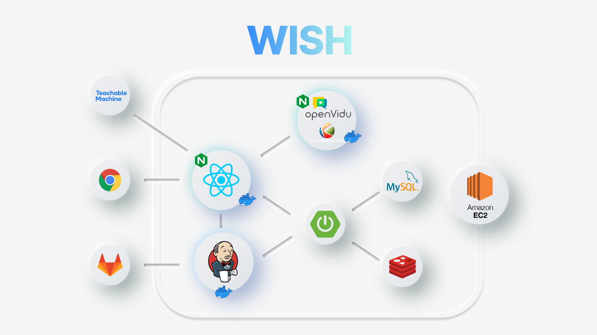

# README

프로젝트 소개

팀소개

세팅가이드

# 1. WISH 서비스 이름 & 소개

## 1.1. 서비스 이름

Want Interview Service in my House

## 1.2. Overview

취준생 여러분들 면접준비는 잘 하고 계신가요? 
코로나 팬데믹으로 인한 비대면 면접의 시대, 여러분의 면접을 WISH에서 준비해보세요!

## 1.3. 주요 서비스 화면

// 리드미 추가분

# 2. 주요 기술 스택

## 2.1. 개발환경

| 분류 | 환경 | 버전 | 주소 |
| --- | --- | --- | --- |
| Database | MySQL | 8.0.x | https://dev.mysql.com/downloads/mysql/ |
| Back | JAVA | Open JDK 1.8.x | ‣ |
|  | Eclipse | - Eclipse IDE 2020-06 R Package
> Eclipse IDE for Enterprise Java Developers | https://www.eclipse.org/downloads/packages/release/2020-06/r |
|  | STS3(Spring Tools 3) | sts3 | 3.9.14.RELEASE |
|  | lombok | 1.18.22 | https://projectlombok.org/download |
| Front | React.js | 17.0.2 |  |
|  | Node.js | 최신 LTS 버전
(16.13.2 LTS) | https://nodejs.org/ko/  |

## 2.2. 서비스 아키텍처

### 2.3. CI/CD

## 2.4. ERD

//  readme 추가분

# 3. 각 팀원 역할

- 최소희
    - 팀장 회의 및 팀 회의 진행
    - 아이디어 해커톤 및 프로젝트 발표
    - 프로젝트 전체 디자인 담당
        - tailwind와 material-ui를 활용한 컴포넌트 레이아웃 구현 및 스타일링
    - 홈화면 및 navbar 기능 추가 및 디자인
        - 유형별 면접방 이동 카드 제작
    - 대기방 리스트 구현 및 디자인
        - 동적 라우팅을 통한 대기방 리스트 이동 구현
        - axios요청하여 각 대기방 정보 반영
    - 마이페이지 디자인
        - 마이페이지 grid 설정 및 스타일링
    - openvidu를 통한 webRTC 기본 기능 구현 및 디자인
        - 면접관, 면접자 역할 구분하여 signal로 스트리밍 기능 구현
- 이우철
    - styled-component와 material-ui를 통한 컴포넌트 레이아웃 구현 및 css 스타일링
    - openvidu를 통한 기본 WebRTC 기능 구현
    - 마이페이지 API 개발(회원정보, 면접횟수, 그래프, 받은 피드백 보여주기)
    - 전체 코드 error 발견 및 debuging
    - UCC 기획 및 편집
- 장영남
    - 프론트개발
        - 회원가입, 로그인, 로그아웃, 비밀번호 찾기, 회원정보수정, 회원탈퇴
        - 방만들기, 방입장, 방리스트, 방검색
        - material-ui와 tailwind를 활용한 컴포넌트 스타일링
    - openvidu를 통한 webRTC 기능 구현, 대기방 면접방 로직구현
        - 대기방
            - 방장, 역할선택, 레디 & 시작, 사전질문 추가기능 구현
            - 대기방에 나중에 들어온 유저에게 현재 대기방 상태(방장, 역할, 레디, 사전질문 등) 반영 구현
        - 면접방
            - 면접관 & 면접자 역할별 화면 분리 구현
            - 질문선택, 평가기능 구현
            - 면접종료후 면접자별 피드백 구현
    
- 조현아
    - Spring Boot를 이용하여 API 서버 개발
    - Spring Boot를 이용한 추천 알고리즘 개발
    - Jenkins를 이용한 CI/CD 도입 및 유지보수
        - Docker 컨테이너화 : react + nginx
        - Docker 컨테이너화 : spring boot
        - Docker-Compose : 프론트 + 백엔드
    - JPA를 활용한 테이블간 관계 설정
    - EC2 서버 관리(인증서 관리, 배포된 Docker 컨테이너 관리)
    - OpenVidu 배포
    - Teachable Machine 통한 자세 인식 모델 학습
    - 문서 관리(Notion)
        - 개발 시 필요한 Backend, 배포 관련 문서 정리
        - 개발환경 문서 관리
    - README 작성 및 README 필요 이미지 제장

- 이정현
    - Spring Boot를 이용하여 API 서버 개발
    - Spring Security 적용 및 JWT 토큰을 통해 인증 및 인가를 관리하는 커스텀 필터 구현
    - 비밀번호 분실 시 가입했던 이메일로 임시 비밀번호 전송 기능 구현
    - KMP 알고리즘을 적용하여 방 제목 및 방 ID, 초성으로 검색 기능 구현
    - Redis를 이용하여 대기방 및 면접방 관리
    - JPA를 활용한 테이블 간 관계 설정
    - Openvidu를 활용한 webRTC 기능 구현(대기방, 면접방)
    - Teachable Machine을 통해 자세 인식 모델 구현
    - EC2 서버 관리
    - 프론트 개발 및 css 스타일링(대기방, 면접방)

# 4. 기술 특이점

## 4.1. 질문 추천 알고리즘

WISH는 보다 다양한 면접질문에 대응할 수 있도록 기출 질문을 제공합니다.

질문을 추천하기 위해 면접 스터디에서 **사용자들이 어떤 질문 선택했는지, 어떤 순서로 선택했는지** count라는 이름으로 DB에서 관리합니다.

질문 추천은 이러한 count를 기반으로 이루어집니다.

### 4.1.1. 연관질문

어떤 순서로 질문을 선택했는지 기록하는 테이블을 ‘연관질문’ 테이블이라고 합니다.

하나의 질문이 한 번 선택될 때마다 count가 1씩 증가하는 ‘기출질문’테이블과는 달리  연관질문은 ‘선행질문parent’과 ‘후행질문child’이 일치해야 count가 증가하기 때문에 한 번 선택시 **count를 3씩 증가**시킵니다.

또한 기출질문보다 **연관질문에서의 추천이 사용자가 더 선호할 가능성**이 있기 때문에 가중치w를 곱하여 우선순위를 높이고 있습니다.

## 4.2. 바른 자세 알림(Teachable Machine)

### 4.2.1. 학습 데이터

학습을 위해 TM을 담당하는 팀원(@조현아 @정현 이)의 모습을 웹캠으로 담아 사용하였습니다.

화상 면접의 경우 구도에 FM이라고 할만한 조건이 있는 만큼 극단적인 구도의 학습을 고려하지 않을 수 있다는 장점이 있었습니다.

정방향에서 머리부터 상반신 일부가 화면의 정중앙에 배치되도록 하였으며 팀원간 머리 길이, 옷의 색을 다르게 맞출 수 있게 하여 데이터를 마련했습니다.

### 4.2.2. Hyper Parameter

hyper parameter는 모델링 시 사용자가 직접 설정하는 값을 의미합니다.

기본적으로 에폭크는 30으로 설정되었으나 우측의 에포크별 정확도와 손실의 추이를 보며 과적합을 방지하기 위해 6으로 줄여 모델링하였습니다.

# 5. 프로젝트 특장점(차별성)

## 5.1. 스터디원 모집

기존의 면접 서비스의 경우 사전에 함께 스터디를 할 팀원을 구해야했기 때문에 어디서 팀원을 구할지 어려워하는 사람들이 많았습니다.

저희 WISH는 언제나 면접방을 생성하고 사람을 모집할 수 있기 때문에 팀원을 구할 걱정을 줄여드립니다.

## 5.2. 피드백 관리

스터디에서 어떤 질문을 받았고, 어떤 피드백을 받았는지 기억이 잘 안나시나요?
WISH에서는 본인이 받은 질문과 그에 대한 피드백을 저장해 마이페이지에서 보여드립니다.

## 5.3. 바른 자세 알림

면접 중 자세가 자주 흐트러져서 신경쓰이시나요? 

WISH에서는 머신러닝 기술을 활용해 바른자세를 유지하고 있는지 상시 표시해드립니다.

## 5.4. 질문 추천

면접스터디를 계속하다 보면 같은 질문만 반복하게 되고, 어떤 질문을 해야할 지 생각이 잘 나지 않을 수 있습니다.

WISH에서는 기출질문 중 상황에 적합한 질문을 추천해드립니다.

## 5.5.  초성 검색

보다 편한 면접스터디방 검색! 이제는 초성으로도 방을 검색할 수 있습니다.

## 5.6. 개발 측면 특장점

### 5.6.1. CI/CD

보다 개발을 편하게하고, 배포가 잘되는지 확인할 수 있도록 jenkins를 통해 CI/CD를 적용했습니다.

또한 백엔드와 프론트엔드 브랜치에서는 각 작업에 대해서만 Docker 이미지로 배포되고, dev 브랜치에서는 둘 모두를 docker-compose를 통해 배포하도록 하였습니다.